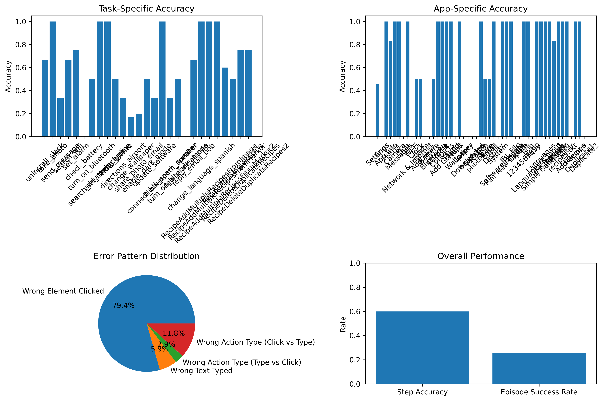

# Android World Agent - Phase 3: Evaluation & Improvement

This phase implements advanced evaluation capabilities, few-shot prompting, and self-reflection for the Android World agent.

## 🚀 Features

### 1. Enhanced Prompting Strategies
- **Few-shot Examples**: Pre-defined examples to improve model understanding
- **Chain-of-Thought**: Step-by-step reasoning prompts
- **Enhanced Templates**: More detailed and structured prompts

### 2. Self-Reflection
- **Automatic Reflection**: Agent analyzes its own decisions
- **Learning Feedback**: Identifies areas for improvement
- **Decision Tracking**: Records reasoning behind each action

### 3. Comprehensive Evaluation Metrics
- **Step-level Accuracy**: Per-step performance measurement
- **Episode Success Rate**: Complete task success tracking
- **Task-specific Analysis**: Performance breakdown by task type
- **Error Pattern Analysis**: Common mistake identification
- **Visualization**: Charts and graphs for performance analysis

---

## 📊 Latest Benchmark Results (2025-07-17)

### Summary Statistics
- **Total Episodes**: 27
- **Total Steps**: 85
- **Correct Steps**: 51
- **Step Accuracy**: 60.00%
- **Successful Episodes**: 7
- **Episode Success Rate**: 25.93%
- **Average Steps per Episode**: 3.1

### Task-Specific Performance
```
- uninstall_slack: 66.67%
- take_photo: 100.00%
- send_message: 33.33%
- search_wifi: 66.67%
- set_alarm: 75.00%
- check_battery: 0.00%
- turn_on_bluetooth: 50.00%
- search_weather_chrome: 100.00%
- add_contact_alice: 100.00%
- mute_phone: 50.00%
- directions_airport: 33.33%
- change_wallpaper: 16.67%
- share_photo_email: 20.00%
- enable_dark_mode: 50.00%
- update_software: 33.33%
- connect_bluetooth_speaker: 100.00%
- block_spam_number: 33.33%
- turn_on_airplane_mode: 50.00%
- delete_all_alarms: 0.00%
- reply_email_bob: 66.67%
- change_language_spanish: 100.00%
- RecipeAddMultipleRecipesFromImage: 100.00%
- RecipeAddMultipleRecipesFromMarkor: 100.00%
- RecipeAddMultipleRecipesFromMarkor2: 60.00%
- RecipeAddSingleRecipe: 50.00%
- RecipeDeleteDuplicateRecipes: 75.00%
- RecipeDeleteDuplicateRecipes2: 75.00%
```

### Error Analysis
- **Wrong Element Clicked**: 27 occurrences
- **Wrong Action Type (Click vs Type)**: 4 occurrences
- **Wrong Text Typed**: 2 occurrences
- **Wrong Action Type (Type vs Click)**: 1 occurrences

### Sample Errors
```
Error 1:
- Episode: uninstall_slack
- Goal: Uninstall the Slack app
- App: Apps
- Predicted: CLICK("Unknown")
- Ground Truth: CLICK("Slack")

Error 2:
- Episode: send_message
- Goal: Send a message to John
- App: Chat
- Predicted: TYPE("Text Input", "Hello John")
- Ground Truth: TYPE("Text Input", "Hello John!")

Error 3:
- Episode: send_message
- Goal: Send a message to John
- App: Chat
- Predicted: TYPE("Text Input", "Hello John")
- Ground Truth: CLICK("Send")
```

### 📈 Latest Visualization



---

**Full PDF report and detailed logs:**
- See `c_reports/` for the latest PDF report (with all stepwise logs and visualizations)
- See `results/` for all raw data, logs, and per-run reports

---

## 📁 File Structure

```
llm_agent_eval/
├── src/
│   ├── agent.py              # Enhanced agent with reflection
│   ├── prompts.py            # Few-shot and enhanced prompts
│   ├── evaluation.py         # Comprehensive evaluation metrics
│   └── __init__.py
├── test_enhanced_agent.py    # Phase 3 test script
├── requirements.txt          # Dependencies
├── README_Phase3.md         # This file
├── evaluation_summary.png    # Latest run visualization
├── c_reports/                # PDF reports
└── results/                  # All run data, logs, and visualizations
```

## 🛠️ Installation

1. **Install Dependencies**:
   ```bash
   pip install -r requirements.txt
   ```

2. **Ensure Ollama is Running**:
   ```bash
   ollama serve
   ```

3. **Verify Model Availability**:
   ```bash
   ollama list
   ```

## 🧪 Usage

### Basic Enhanced Agent Test
```bash
python test_enhanced_agent.py
```

### Custom Evaluation
```python
from src.agent import OllamaProvider, AndroidWorldAgent
from src.evaluation import EvaluationAnalyzer

# Initialize agent with enhanced features
provider = OllamaProvider(model="gemma3:12b-it-qat")
agent = AndroidWorldAgent(
    provider, 
    prompt_template="enhanced",  # Use few-shot examples
    enable_reflection=True       # Enable self-reflection
)

# Run evaluation
analyzer = EvaluationAnalyzer()
# ... add episode results ...
report = analyzer.generate_report()
```

## 📊 Evaluation Metrics

### Basic Metrics
- **Step Accuracy**: Percentage of correct individual actions
- **Episode Success Rate**: Percentage of fully completed tasks
- **Average Steps per Episode**: Efficiency measurement

### Advanced Metrics
- **Task-specific Accuracy**: Performance by task type
- **App-specific Accuracy**: Performance by application
- **Error Pattern Analysis**: Common mistake categories
- **Response Time Analysis**: Performance timing

### Self-Reflection Metrics
- **Reflection Quality**: Depth of self-analysis
- **Learning Improvement**: Performance improvement over time
- **Decision Confidence**: Certainty in predictions

## 🎯 Prompting Strategies

### 1. Enhanced (Few-shot)
```python
agent = AndroidWorldAgent(provider, prompt_template="enhanced")
```
- Includes 4 pre-defined examples
- Shows reasoning for each example
- Structured step-by-step thinking

### 2. Chain-of-Thought (CoT)
```python
agent = AndroidWorldAgent(provider, prompt_template="cot")
```
- Explicit reasoning steps
- Goal analysis → Context understanding → Strategy → Action
- More detailed thought process

### 3. Simple (Basic)
```python
agent = AndroidWorldAgent(provider, prompt_template="simple")
```
- Basic prompt without examples
- Minimal guidance
- Baseline comparison

## 📈 Visualization

The evaluation system automatically generates:
- **Accuracy Comparison Charts**: Task and app-specific performance
- **Error Pattern Distribution**: Pie chart of common mistakes
- **Overall Performance Metrics**: Bar charts of key indicators

## 🔍 Error Analysis

### Error Categories
1. **Wrong Element Clicked**: Correct action type, wrong target
2. **Wrong Text Typed**: Incorrect text input
3. **Wrong Action Type**: Click vs Type confusion
4. **Format Error**: Malformed response

## 📝 Self-Reflection Example

```python
# Enable reflection
agent = AndroidWorldAgent(provider, enable_reflection=True)

# After running an episode
for reflection in agent.reflection_history:
    print(f"Step {reflection['step_index']}:")
    print(f"Correct: {reflection['was_correct']}")
    print(f"Reflection: {reflection['reflection']}")
```

## 🎛️ Configuration Options

### Agent Configuration
```python
agent = AndroidWorldAgent(
    llm_provider=provider,
    prompt_template="enhanced",    # "enhanced", "cot", "simple"
    enable_reflection=True         # True/False
)
```

### Evaluation Configuration
```python
analyzer = EvaluationAnalyzer()
analyzer.add_episode_result(result)
analyzer.generate_report("report.md")
analyzer.create_visualizations("plots/")
```

## 🚀 Next Steps

1. **Scale Testing**: Run on larger episode datasets
2. **Model Comparison**: Test different Ollama models
3. **Prompt Engineering**: Optimize few-shot examples
4. **Real Android World**: Integrate with actual benchmark data
5. **Performance Optimization**: Improve response times

## 🔧 Troubleshooting

### Common Issues
1. **Ollama Connection Error**: Ensure `ollama serve` is running
2. **Model Not Found**: Check available models with `ollama list`
3. **Import Errors**: Install missing dependencies from `requirements.txt`
4. **Memory Issues**: Use smaller models for testing

### Performance Tips
- Use smaller models (gemma3:1b-it-qat) for faster testing
- Disable reflection for basic evaluation
- Use simple prompts for initial testing
- Monitor system resources during evaluation

## 📚 References

- [Android World Benchmark](https://github.com/google-research/android_world)
- [Ollama Documentation](https://ollama.ai/docs)
- [Few-shot Learning](https://arxiv.org/abs/2005.14165)
- [Chain-of-Thought Prompting](https://arxiv.org/abs/2201.11903) 